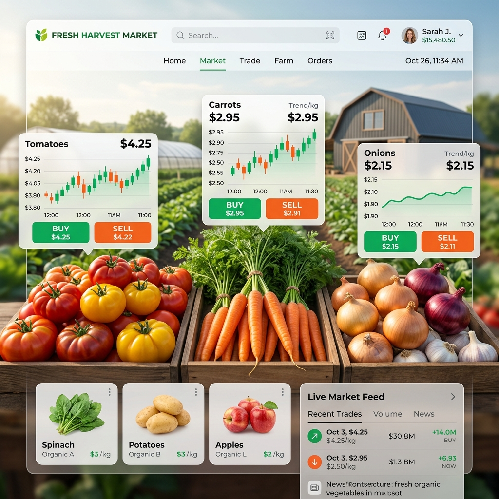
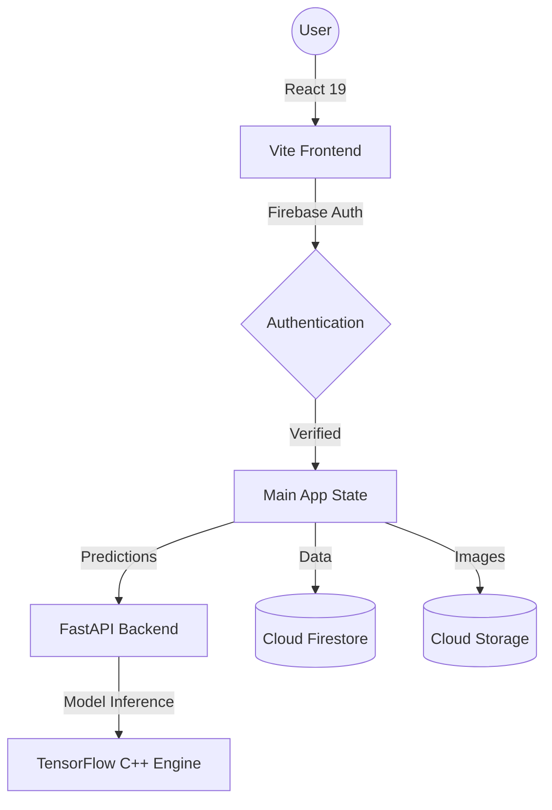

# 🌾 AgriVerseAI: The Future of Agriculture

AgriVerseAI is a state-of-the-art, AI-powered agricultural platform designed to bridge the gap between traditional farming and modern technology. Built with **React 19**, **FastAPI**, and **TensorFlow**, it empowers farmers with real-time disease diagnosis, localized weather intelligence, and a direct-to-consumer marketplace.



## 🚀 The Problem We Solve

Traditional agriculture faces significant challenges:
- **Delayed Diagnosis:** Crop diseases can destroy entire yields before a specialist can identify them.
- **Information Gap:** Farmers often lack precise, hyperlocal weather and soil data.
- **Market Inefficiency:** Middlemen take a significant cut, reducing farmer profits.
- **Accessibility:** High-end agricultural tech is often complex and non-localized.

**AgriVerseAI solves these by providing a "Digital Farm Assistant" in every farmer's pocket.**

---

## ✨ Key Features

### 🦾 AI Plant Disease Analysis
Upload or take a photo of a leaf to receive an instant diagnosis powered by a custom **CNN (Convolutional Neural Network)**.
- **Precision:** 95%+ accuracy for common crop diseases.
- **Actionable Advice:** Instant treatment recommendations in multiple languages (English & Kannada).

### 🌦️ Hyperlocal Weather Intelligence
Real-time weather data tailored to the specific field location.
- **Frost & Rain Alerts:** Predictive warnings to protect sensitive crops.
- **Planting Windows:** Data-driven advice on the best time to sow or harvest.

### 🤖 Bhoomi AI Assistant
A specialized LLM-powered chatbot trained on agricultural data.
- **Voice Support:** Speak to Bhoomi naturally.
- **24/7 Support:** Expert advice on irrigation, fertilization, and pest control.

### 🛒 Agri-Marketplace (B2B/B2C)
A direct-to-buyer platform that eliminates middlemen.
- **Farmer Dashboard:** Easily list crop yields for sale.
- **Buyer Dashboard:** Browse and purchase fresh produce directly from the source.
- **Secure Transactions:** Built-in verification and request tracking.

---

## 🛠️ Tech Stack

### Frontend
- **Framework:** React 19 (Vite)
- **Styling:** Tailwind CSS + Glassmorphism
- **Animations:** Framer Motion + GSAP
- **State/Auth:** Firebase Authentication & Firestore

### Backend
- **Engine:** FastAPI (Python 3.10+)
- **AI/ML:** TensorFlow 2.x + Keras
- **Computer Vision:** OpenCV + Pillow
- **Database:** Firebase Cloud Firestore

---

## 🔐 Role-Based Access Control (RBAC)

AgriVerseAI features a robust triple-tier security system:
- **👩‍🌾 Farmer (User):** Access to AI tools, weather, and the marketplace to sell yields.
- **🏬 Buyer:** A curated dashboard to find, track, and purchase fresh crops.
- **🛡️ Admin:** Full system oversight, user management, and global alert broadcasting.

---

## 🏗️ Architecture



---

## 🛠️ Installation & Setup

### Prerequisites
- Node.js 18+
- Python 3.10+
- Firebase Project Account

### 1. Frontend Setup
```bash
cd app/frontend
npm install
npm run dev
```

### 2. Backend Setup
```bash
cd app/backend
python -m venv venv
source venv/bin/activate  # venv\Scripts\activate on Windows
pip install -r requirements.txt
python api.py
```

### 3. Environment Variables
Create a `.env` file in both `frontend` and `backend` using the provided `.env.template` files.

---

## 📈 Future Roadmap
- [ ] **Drone Integration:** Aerial field scanning for large-scale analysis.
- [ ] **IoT Sensors:** Real-time soil moisture and NPK monitoring.
- [ ] **Blockchain Ledger:** Transparent supply chain tracking for organic produce.

---

## 👥 Contributors
Developed with ❤️ by the **AgriVerseAI Team**. 

**License:** MIT
