# AgriVerseAI - System Architecture Documentation

## 📋 Table of Contents
1. [System Overview](#system-overview)
2. [Plant Disease Analysis Module](#plant-disease-analysis-module)
3. [Soil Analysis Module](#soil-analysis-module)
4. [Crop Marketplace (Sell) Module](#crop-marketplace-module)
5. [Weather Module](#weather-module)
6. [ML Model Training Architecture](#ml-model-training-architecture)

---

## System Overview

AgriVerseAI is a comprehensive AI-powered agricultural platform designed for farmers in Karnataka, India. The system provides bilingual support (English and Kannada) and integrates multiple AI/ML services for plant disease detection, soil analysis, market price prediction, and weather forecasting.

### High-Level System Architecture

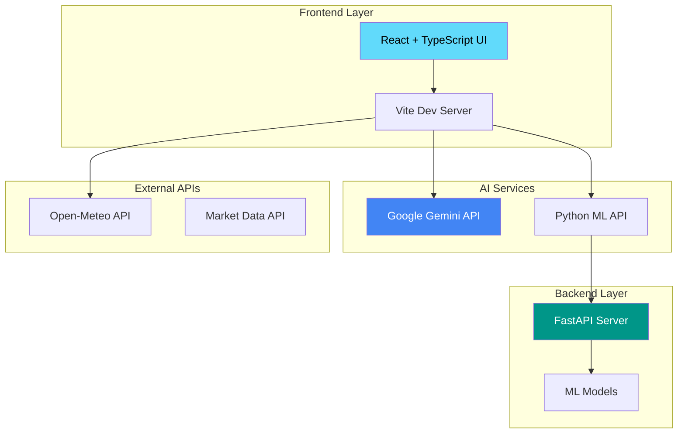

---

## Plant Disease Analysis Module

### Overview
The Plant Disease Analysis module uses a hybrid AI approach combining a local Python ML model for fast initial detection and Google Gemini Vision for detailed bilingual explanations.

### Architecture Diagram

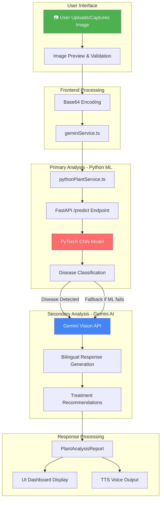

### Data Flow

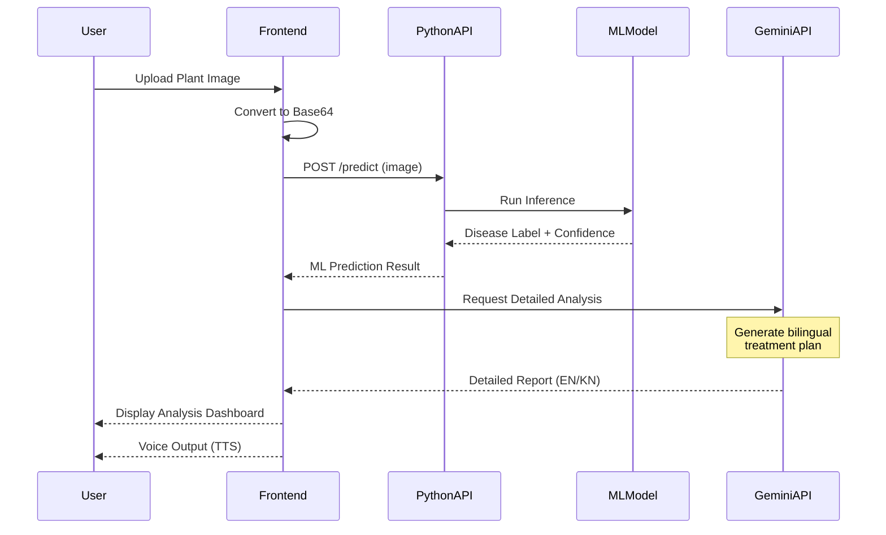

### PlantAnalysisReport Schema

```typescript
interface PlantAnalysisReport {
    isDiseaseFound: boolean;
    diseaseName: { en: string; kn: string };
    confidence: number;
    description: { en: string; kn: string };
    severity: { en: string; kn: string };
    symptoms: { en: string[]; kn: string[] };
    prevention: { en: string[]; kn: string[] };
    treatment: { en: string[]; kn: string[] };
    medicineName: { en: string; kn: string };
    medicineUsage: { en: string; kn: string };
}
```

---

## Soil Analysis Module

### Overview
The Soil Analysis module provides real-time crop recommendations based on soil parameters (N, P, K, pH) and climate conditions (temperature, rainfall) specific to Karnataka districts.

### Architecture Diagram

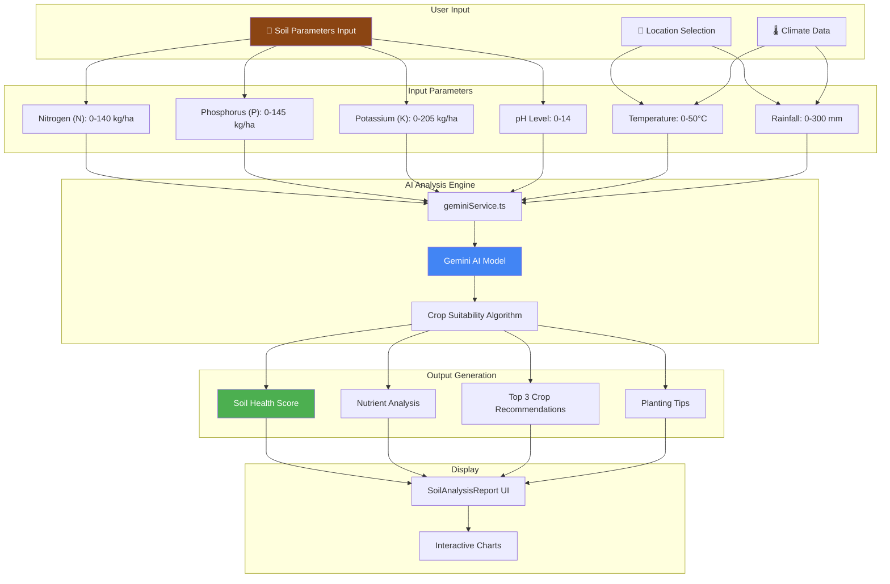

### Analysis Flow

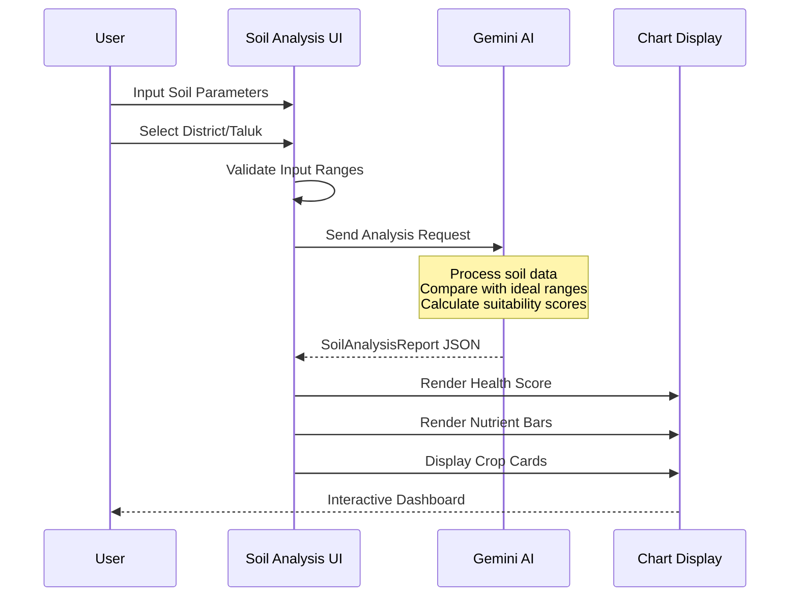

### SoilAnalysisReport Schema

```typescript
interface SoilAnalysisReport {
    overallHealthScore: number; // 0-100
    healthSummary: { en: string; kn: string };
    nutrientAnalysis: {
        nitrogen: { level: string; status: string };
        phosphorus: { level: string; status: string };
        potassium: { level: string; status: string };
        ph: { level: string; status: string };
    };
    cropRecommendations: Array<{
        name: { en: string; kn: string };
        suitabilityScore: number;
        plantingTips: { en: string; kn: string };
        expectedYield: string;
    }>;
}
```

---

## Crop Marketplace Module

### Overview
The Crop Marketplace provides real-time price analysis across Karnataka's APMC markets, enabling farmers to make informed selling decisions.

### Architecture Diagram

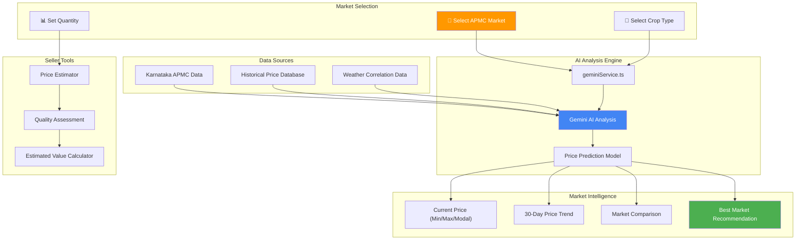

### Price Analysis Flow

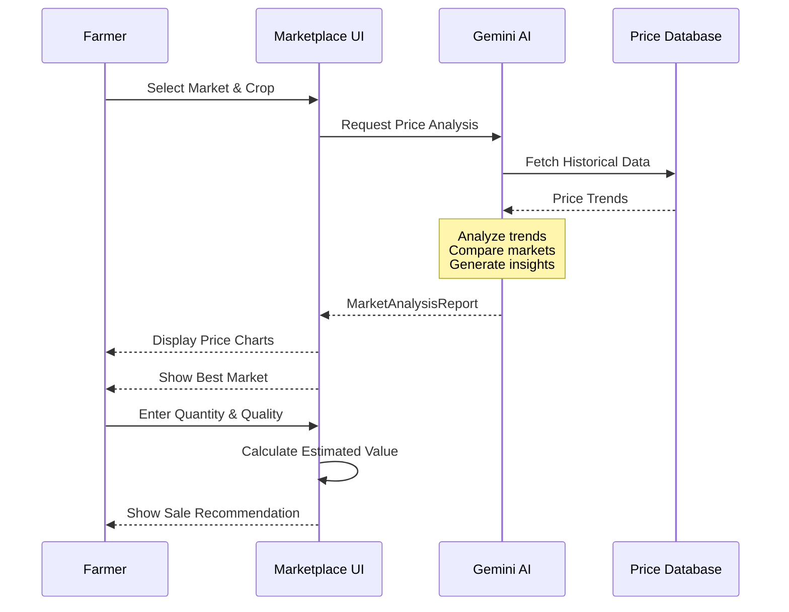

### MarketAnalysisReport Schema

```typescript
interface MarketAnalysisReport {
    crop: string;
    market: string;
    currentPrices: {
        minPrice: number;
        maxPrice: number;
        modalPrice: number;
    };
    priceTrend: Array<{ date: string; price: number }>;
    marketComparison: Array<{
        marketName: string;
        price: number;
        distance: string;
    }>;
    aiInsight: { en: string; kn: string };
    bestMarketToSell: string;
    priceEstimate: {
        quantity: number;
        quality: string;
        estimatedValue: number;
    };
}
```

---

## Weather Module

### Overview
The Weather module provides hyperlocal weather forecasts for all 31 Karnataka districts using the Open-Meteo API, with agricultural-specific insights.

### Architecture Diagram

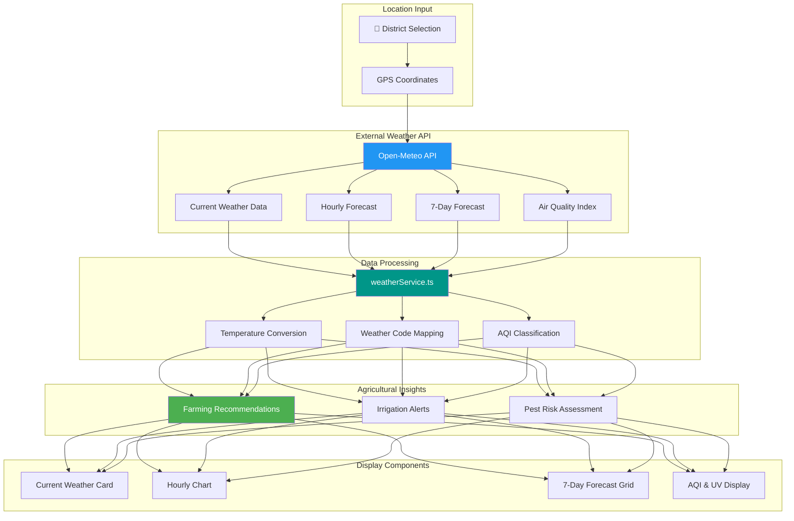

### Weather Data Flow

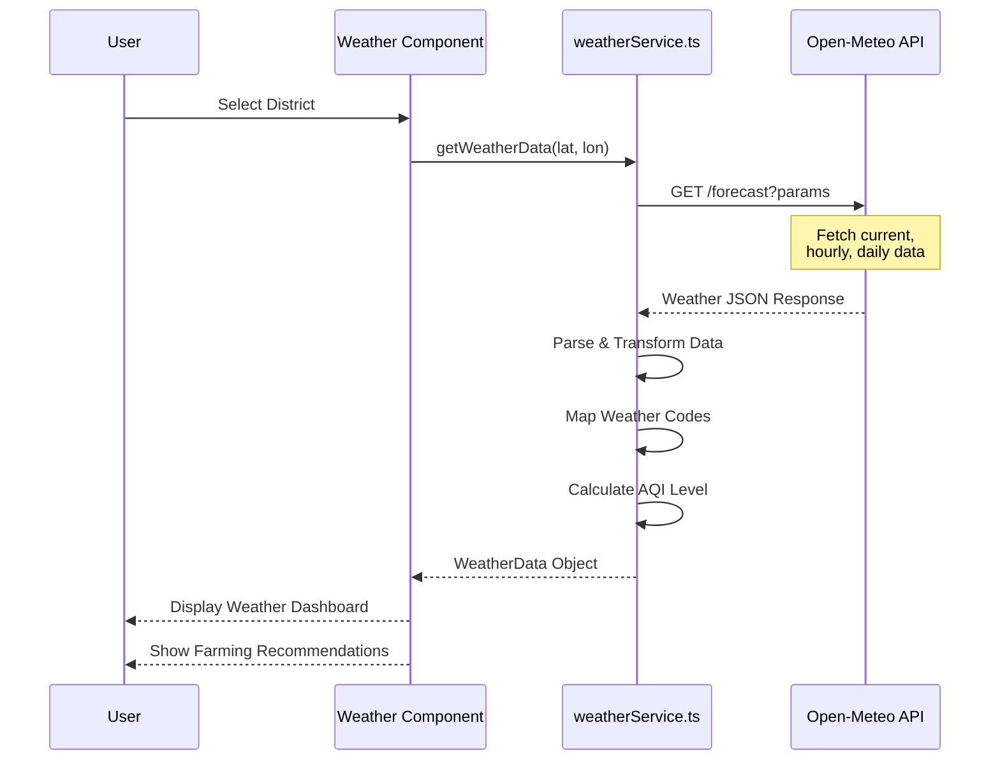

### Karnataka Districts Coverage

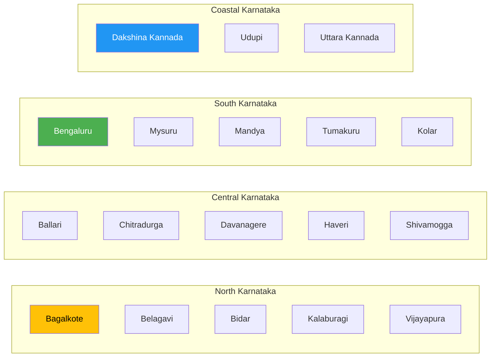

---

## ML Model Training Architecture

### Overview
The ML pipeline for plant disease detection uses PyTorch with a CNN architecture (ResNet-based) trained on agricultural disease datasets.

### Training Pipeline Architecture

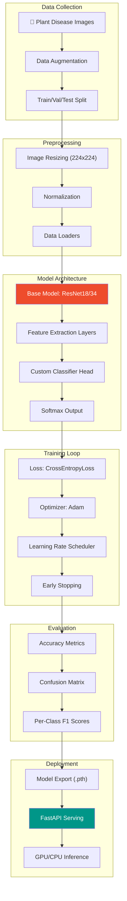

### Model Architecture Detail

```mermaid
flowchart LR
    subgraph "Input"
        A["RGB Image<br/>224 x 224 x 3"]
    end
    
    subgraph "ResNet Backbone"
        B["Conv1 + BN + ReLU"]
        C["MaxPool"]
        D["Layer1 (64 filters)"]
        E["Layer2 (128 filters)"]
        F["Layer3 (256 filters)"]
        G["Layer4 (512 filters)"]
    end
    
    subgraph "Classifier"
        H["Global Avg Pool"]
        I["FC: 512 → 256"]
        J["ReLU + Dropout"]
        K["FC: 256 → N_classes"]
        L["Softmax"]
    end
    
    subgraph "Output"
        M["Disease Probabilities"]
        N["Top-1 Prediction"]
    end
    
    A --> B --> C --> D --> E --> F --> G
    G --> H --> I --> J --> K --> L
    L --> M --> N
    
    style A fill:#9C27B0,color:#fff
    style G fill:#EE4C2C,color:#fff
    style N fill:#4CAF50,color:#fff
```

### Training Configuration

```python
# Model Configuration
CONFIG = {
    "model": {
        "backbone": "resnet18",
        "pretrained": True,
        "num_classes": 38,  # PlantVillage dataset
        "dropout": 0.5
    },
    "training": {
        "batch_size": 32,
        "epochs": 50,
        "learning_rate": 0.001,
        "weight_decay": 1e-4,
        "early_stopping_patience": 10
    },
    "augmentation": {
        "random_horizontal_flip": True,
        "random_rotation": 15,
        "color_jitter": 0.2,
        "random_crop": 224
    },
    "data": {
        "train_split": 0.7,
        "val_split": 0.15,
        "test_split": 0.15
    }
}
```

### Inference Pipeline

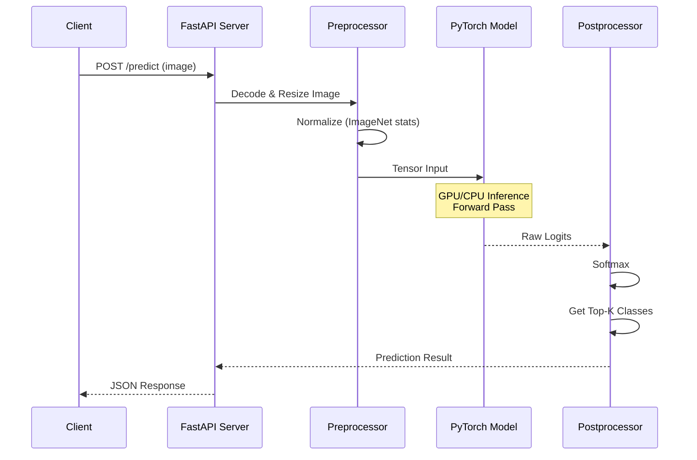

---

## Technology Stack Summary

| Layer | Technology | Purpose |
|-------|------------|---------|
| **Frontend** | React + TypeScript | UI Components |
| **Styling** | TailwindCSS | Responsive Design |
| **Build Tool** | Vite | Fast Development |
| **Animation** | Framer Motion | Smooth Transitions |
| **AI/Chat** | Google Gemini API | Text & Vision AI |
| **TTS** | Web Speech API | Voice Output |
| **Backend** | FastAPI (Python) | ML API Server |
| **ML Framework** | PyTorch | Model Training |
| **Weather API** | Open-Meteo | Weather Data |
| **Database** | Supabase | Authentication |

---

## File Structure

```
d:\app\
├── frontend/
│   ├── components/
│   │   ├── BhoomiAssistant.tsx      # Main AI Chat
│   │   ├── PlantAnalysisResult.tsx  # Disease Display
│   │   ├── SoilAnalysis.tsx         # Soil Analysis UI
│   │   ├── Marketplace.tsx          # Crop Selling
│   │   └── WeatherDisplay.tsx       # Weather Module
│   ├── services/
│   │   ├── geminiService.ts         # Gemini AI Integration
│   │   ├── pythonPlantService.ts    # Python ML API
│   │   └── weatherService.ts        # Weather API
│   └── types.ts                     # TypeScript Types
│
├── backend/
│   ├── api.py                       # FastAPI Endpoints
│   ├── model.py                     # PyTorch Model
│   └── utils/
│       └── predictor.py             # Inference Logic
│
└── run_app.py                       # Application Launcher
```

---

## API Endpoints Summary

| Endpoint | Method | Description |
|----------|--------|-------------|
| `/predict` | POST | Plant disease prediction |
| `/health` | GET | API health check |
| `/models` | GET | Available ML models |

---

*Documentation generated for AgriVerseAI Platform*
*Last Updated: January 2026*
